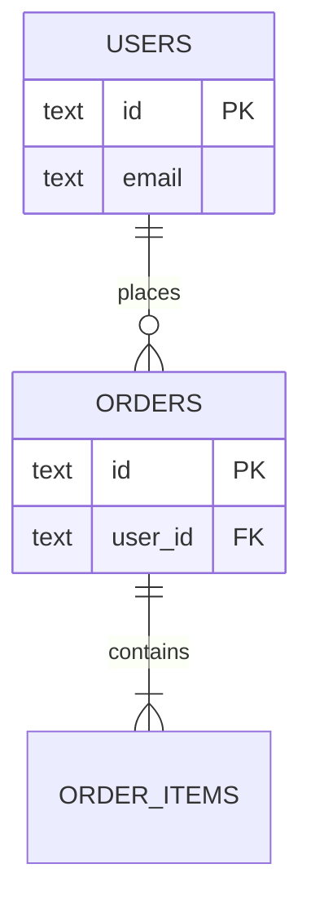

# Data Architecture

> **Template.** Fill each section, delete the prompts. Cite schema as `<file:line>`.

## Overview

> One paragraph: database, ORM, table count, schema organization.

## Schema conventions

> The patterns every table follows so new tables match.

- Primary keys: {{e.g. text/uuid}}
- Timestamps: {{e.g. created_at / updated_at with timezone}}
- Type inference: {{e.g. `typeof table.$inferSelect`}}
- {{other convention}}

## Entity overview

> One line per core table and what it holds.

| Table | Holds |
|---|---|
| `{{users}}` | {{…}} |
| `{{orders}}` | {{…}} |

## ER diagram

> Replace placeholder entities/relations with the real ones.

## Key invariants & constraints

> The rules the data must always satisfy — DB constraints AND app-enforced ones.
> Note where each is enforced (DB check vs. validation layer).

- {{invariant}} — enforced at `<file:line>`

## Migrations

> How schema changes are generated and applied (commands + workflow).

## Related docs

- Backend: [`backend.md`](./backend.md)
- System: [`system.md`](./system.md)
