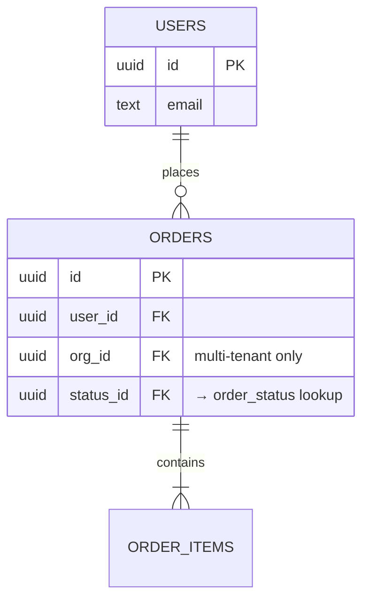

# Data Architecture

> **Template.** Fill each section, delete the prompts. Cite schema as `<file:line>`.

## Overview

> One paragraph: database, ORM, table count, schema organization.

## Schema conventions

> The patterns every table follows so new tables match. Kit defaults below — keep them unless an
> ADR says otherwise.

- **Primary keys:** UUIDv7 (`uuid().$defaultFn(uuidv7)`) — time-ordered, btree-friendly. Never auto-increment.
- **Timestamps:** `created_at` / `updated_at` with timezone on every table.
- **Statuses / enums:** lookup tables referenced by FK — not inline `text` enums or `pgEnum`. Rename a label without a migration; the DB enforces valid values.
- **Soft delete:** `deleted_at` only on tables whose feature needs undelete — not blanket.
- **Type inference:** `typeof table.$inferSelect` / `$inferInsert`.
- **Migrations only:** schema reaches every DB via a generated, committed migration. No `db:push`.

## Tenancy

> **Fill from the App Profile (`CLAUDE.md`).** This is the single biggest schema decision.

- **Model:** {{single-tenant | multi-tenant}}
- **Tenant unit** (multi-tenant): `{{org}}` — the boundary owner.
- **Scoping** (multi-tenant): every tenant table carries `org_id` (FK → `{{org}}`) and a composite
  index leading with it (`(org_id, created_at)`, …). Every query is scoped through the `forOrg(orgId)`
  helper; the API tier is the enforcement wall (app-layer scoping). RLS is optional hardening, not
  required — record the choice in an ADR.
- **Enforcement gap to state honestly:** {{e.g. "a raw `db` query bypasses `forOrg` — scoping is a
  convention the API centralises, not a DB constraint, until/unless RLS is added"}}.

## Entity overview

> One line per core table and what it holds.

| Table | Holds |
|---|---|
| `{{users}}` | {{…}} |
| `{{orders}}` | {{…}} |

## ER diagram

> Replace placeholder entities/relations with the real ones.

## Key invariants & constraints

> The rules the data must always satisfy — DB constraints AND app-enforced ones.
> Note where each is enforced (DB check vs. validation layer).

- {{invariant}} — enforced at `<file:line>`

## Migrations

> How schema changes are generated and applied. **Migrations only — `db:push` is banned** (it
> desyncs the migration history from the DB and the file tree). Workflow: edit schema →
> `pnpm db:generate` → review SQL → `pnpm db:migrate`.

## Related docs

- Backend: [`backend.md`](./backend.md)
- System: [`system.md`](./system.md)
