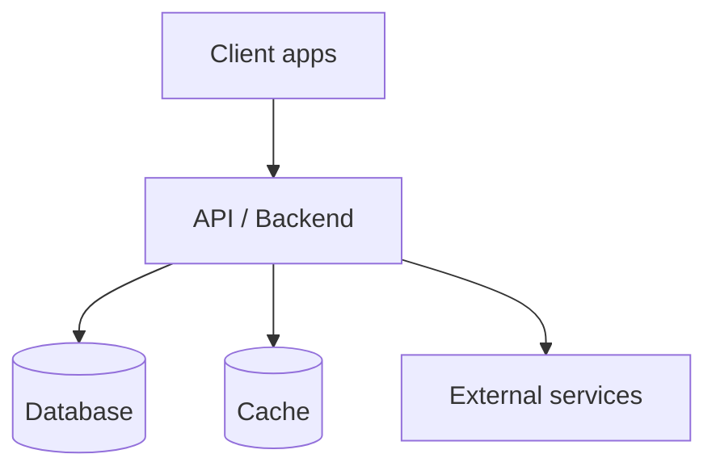

# System Architecture

> **Template.** Fill each section, delete the prompts. This is the map — keep it
> high-level and link down into `backend.md`, `frontend.md`, `data.md`.

## Stack at a glance

> One line per layer: language/framework, key libraries, hosting.

| Layer | Technology |
|---|---|
| Frontend | {{e.g. Next.js}} |
| Backend | {{e.g. API framework}} |
| Database | {{e.g. PostgreSQL + ORM}} |
| Cache / queue | {{e.g. Redis}} |
| Auth | {{…}} |
| Hosting | {{…}} |

## System diagram

> Replace the placeholder nodes with your real services and data stores.

## Service boundaries

> What each deployable service owns and does NOT own. One block per service.

- **{{Service}}** — owns {{…}}; does not own {{…}}.

## Request lifecycle

> Trace one representative request end to end (client → edge → API → guards →
> service → DB → response). Numbered steps.

1. {{Client sends …}}
2. {{Edge / middleware …}}
3. {{Auth / guards …}}
4. {{Controller → service …}}
5. {{DB read/write …}}
6. {{Response envelope returned …}}

## Cross-cutting concerns

> One line each, with a code citation.

- **Auth / sessions:** `<file:line>`
- **Error handling:** `<file:line>`
- **Logging / request id:** `<file:line>`
- **Rate limiting:** `<file:line>`

## Related docs

- Backend: [`backend.md`](./backend.md)
- Frontend: [`frontend.md`](./frontend.md)
- Data: [`data.md`](./data.md)
- Integrations: [`integrations.md`](./integrations.md)
